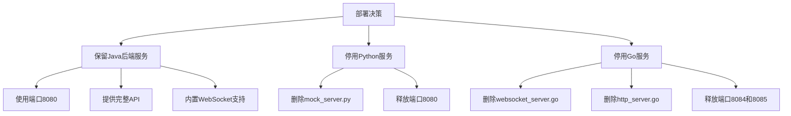

# 爆款内容生成器后端部署说明

## 部署概览

根据项目需求，已完成以下部署准备工作：
1. 保留并配置Java后端服务作为核心服务
2. 移除Python模拟服务（原占用端口8080）
3. 移除Go WebSocket服务（原占用端口8084）
4. 移除Go HTTP服务（原占用端口8085）
5. 更新前端配置以适配新的后端服务地址
6. 创建Docker部署配置文件

## 部署架构



## 部署步骤

### 1. 构建Java应用

首先确保已安装Maven，然后在项目根目录执行：

```bash
mvn clean package
```

### 2. Docker部署（推荐）

使用Docker Compose一键部署所有服务：

```bash
docker-compose up -d
```

该命令将启动以下服务：
- Java后端服务（端口8080）
- MySQL数据库（端口3306）
- Redis缓存（端口6379）

### 3. 直接运行（可选）

如果不使用Docker，可以直接运行Java应用：

```bash
java -jar target/script-generator-1.0.0.jar
```

注意：直接运行需要本地已安装并配置好MySQL和Redis。

## 服务验证

### 1. 检查服务启动状态

```bash
# Docker部署方式
docker-compose ps

# 或者检查端口占用
netstat -tuln | grep :8080
```

### 2. 验证API接口

访问以下URL验证服务是否正常运行：
- 健康检查：http://localhost:8080/actuator/health
- API接口：http://localhost:8080/api/

### 3. 验证WebSocket连接

使用WebSocket客户端连接以下地址：
- WebSocket地址：ws://localhost:8080/ws/teleprompter

## 端口使用情况

| 服务 | 端口 | 用途 |
|------|------|------|
| Java后端服务 | 8080 | API接口和WebSocket |
| MySQL数据库 | 3306 | 数据存储 |
| Redis缓存 | 6379 | 缓存和会话管理 |

## 注意事项

1. 首次启动时，MySQL数据库会自动创建`script_generator`数据库
2. 应用会自动创建所需的表结构
3. 如需修改数据库密码或Redis配置，请更新`docker-compose.yml`中的环境变量
4. 前端小程序需要更新配置以连接新的后端地址